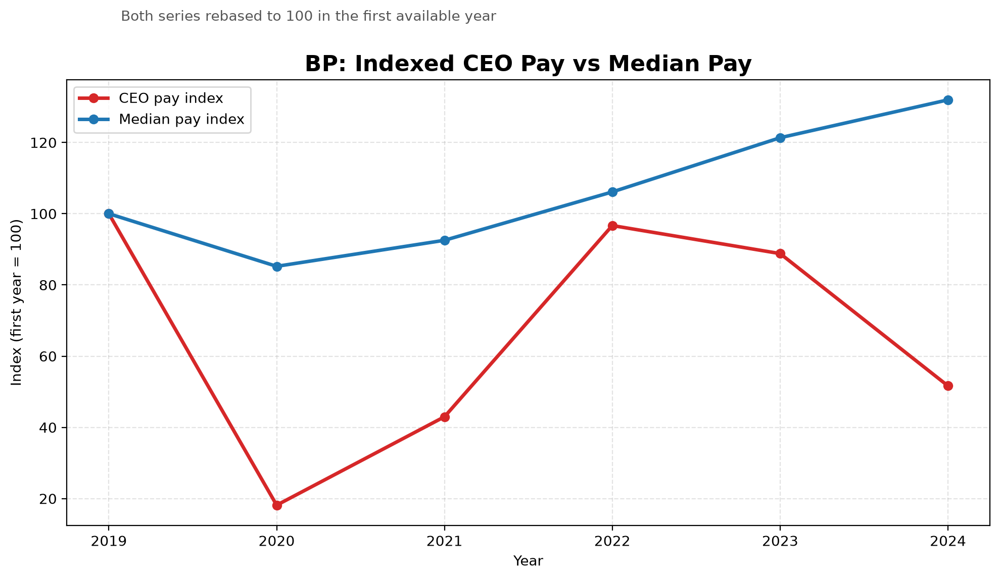
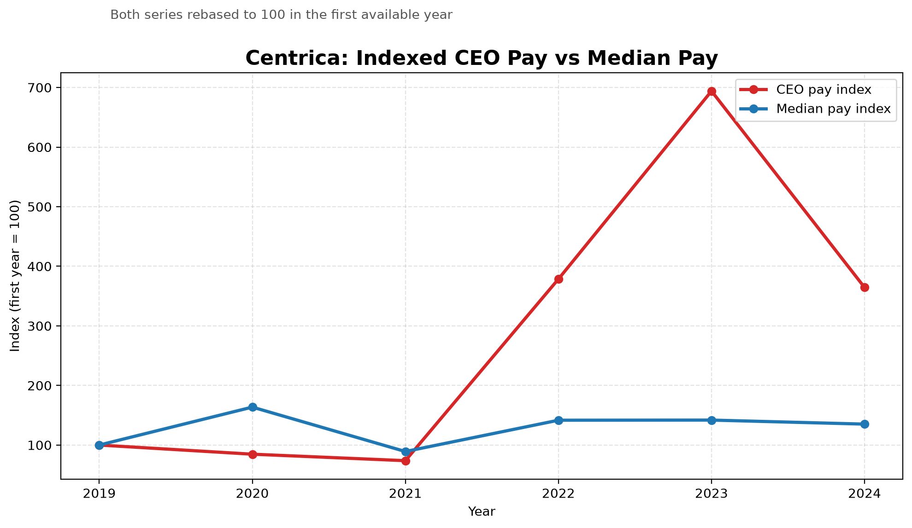
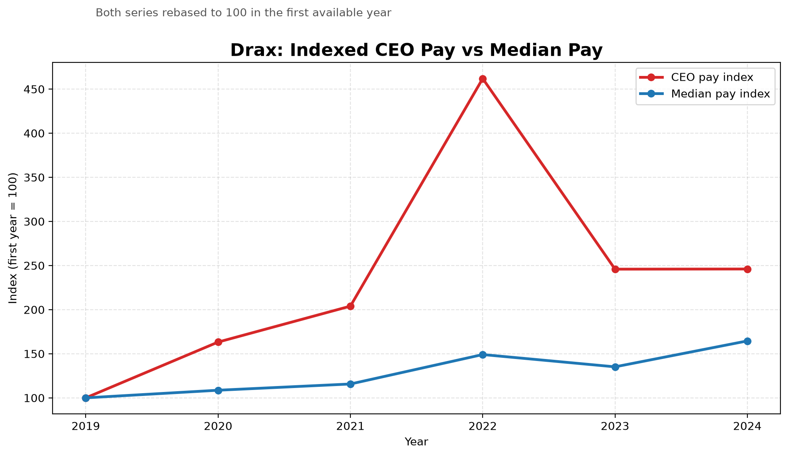

# Profit vs Pay

A small data project looking at pay inequality inside major UK energy and utilities companies.

I built this to explore a simple question: how has executive pay moved compared with typical employee pay inside UK energy-related businesses? The starting point for this repo is UK pay-ratio disclosure data, especially CEO pay and employee pay bands. From there, I cleaned the dataset, narrowed it to energy and utilities companies, filtered it down again to firms with enough history to compare over time, and generated company-level charts showing how CEO pay has moved against median employee pay.

## Key findings

- At Centrica, indexed CEO pay rose by roughly `264%` from `2019` to `2024`, while indexed median employee pay rose by about `35%`.
- At Drax, CEO pay rose by roughly `146%` over `2019` to `2024`, compared with median pay growth of about `65%`.
- The pattern is not one-way: BP and Shell both show cases where median employee pay rose while indexed CEO pay ended below its own starting point.

That mix is what made the project more interesting to me. The dataset does not just show "CEO pay always goes up"; it shows which firms pulled away sharply and which firms did not.

## Sample charts

## What this project does

- Cleans raw UK pay disclosure data into analysis-ready CSV files.
- Filters the project down to oil, gas, electricity, and utility-related companies.
- Keeps only companies with more than 4 years of usable pay records.
- Preserves CEO pay, lower quartile pay, median pay, upper quartile pay, and employee counts where available.
- Produces indexed pay charts so trends can be compared on the same scale.

## Current dataset

- `10` companies after sector filtering and history filtering.
- `58` cleaned yearly observations.
- Coverage from `2019` to `2025`.
- Each company kept in the final cleaned data has at least `5` yearly rows.

## Why I chose indexed charts

Raw pay numbers are useful, but they can also hide the pace of change. Re-indexing both lines to `100` in the first available year makes the comparison much clearer:

- one line shows how CEO pay changes over time
- one line shows how median employee pay changes over time
- both start from the same baseline, so the divergence is easier to spot

That makes the charts more about trend and inequality than just absolute salary size.

## Repo structure

- `data/raw/`
  Raw source data.
- `data/cleaned/`
  Cleaned outputs, filtered company lists, and generated charts.
- `analysis.ipynb`
  Notebook walkthrough of the project story, charts, and findings.
- `scripts/dataCleaner.py`
  Main cleaning pipeline for the energy-sector pay dataset.
- `scripts/plotIndexedPayCharts.py`
  Chart generation script for indexed CEO vs median pay trends.

## What I worked on technically

- Data cleaning with `pandas`
- Column renaming and type conversion
- Handling missing values without losing useful company history
- Filtering by time-series coverage
- Exporting clean datasets for analysis and visualisation
- Automating chart generation across the filtered energy company set

## What I’d improve next

- Add a small company selector so individual case studies are easier to browse.
- Compare oil and gas firms against utilities more directly instead of treating the sector as one block.

## CV angle

One clean way to describe this project on a CV:

`Built a Python data pipeline using pandas and matplotlib to analyse CEO versus median employee pay across 10 UK energy and utilities companies from 2019 to 2025, highlighting where indexed executive pay diverged sharply from worker pay growth.`

## Files worth looking at

- [Notebook walkthrough](analysis.ipynb)
- [Cleaned wages data](data/cleaned/wages.csv)
- [Top companies file](data/cleaned/companies.csv)
- [Generated charts folder](data/cleaned/charts)
- [Data cleaning script](scripts/dataCleaner.py)
- [Chart script](scripts/plotIndexedPayCharts.py)

This repo is basically me using public company pay disclosures to turn a messy raw dataset into something easier to inspect, compare, and question within the UK energy and utilities space.
